# How to Make a Life Counter

In this tutorial, you will make a demo of a life counter like you see in many classic video games such as PacMan, Donkey Kong, and Galaga.

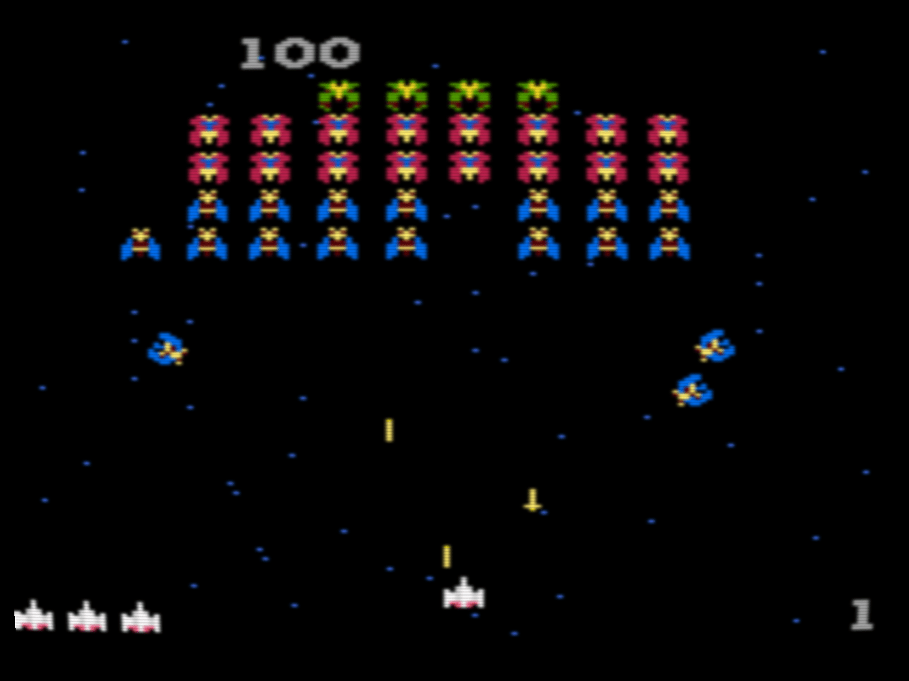
> In a video game, you may lose a life from falling off a cliff or running out of life, but for the purposes of this demo, we will use a button to cause our "Player" to lose a life.

## Setup

1. Download a picture of a heart and import it into Godot
   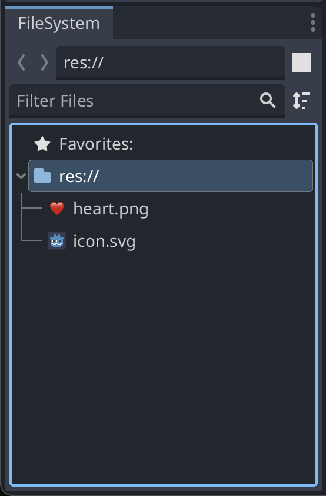
2. Switch to the 2D view and add a Node as root of the scene followed by 3 Sprite2Ds.
   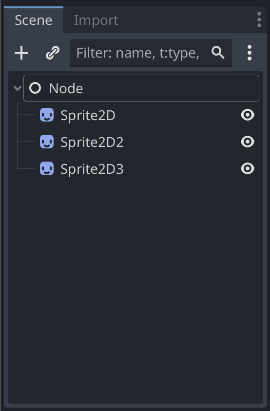
3. Rename your nodes
   
4. Fill in the sprites with your image of the heart
   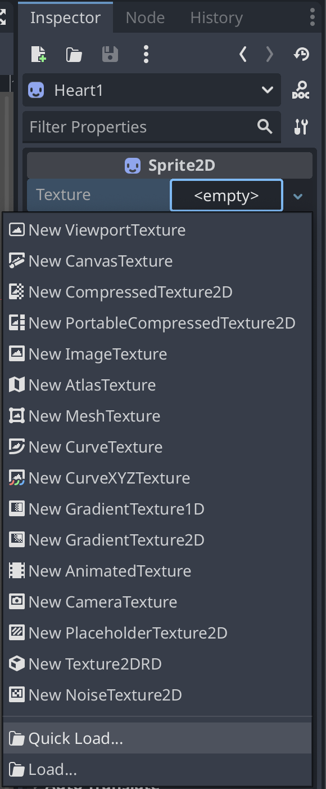
5. Spread them out and scale them if necessary
   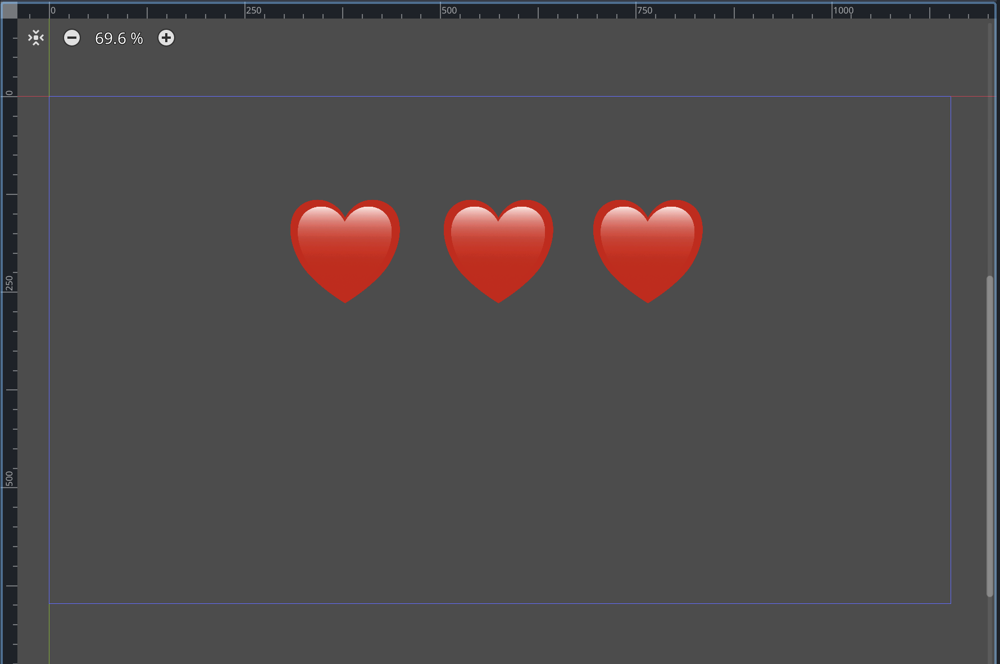
6. Add a button. Remember, we will be using a button to demonstrate losing a life.
   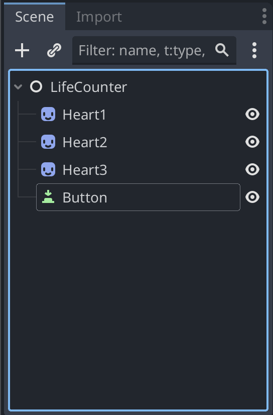
7. Name the button "LoseLifeButton"
   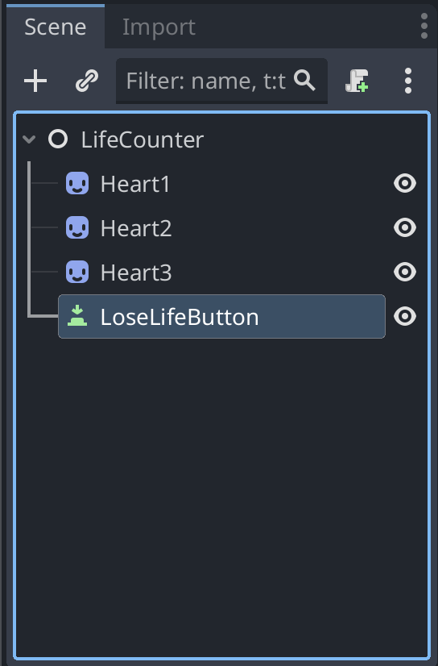
8. Fill in the button text to say "Lose Life"
   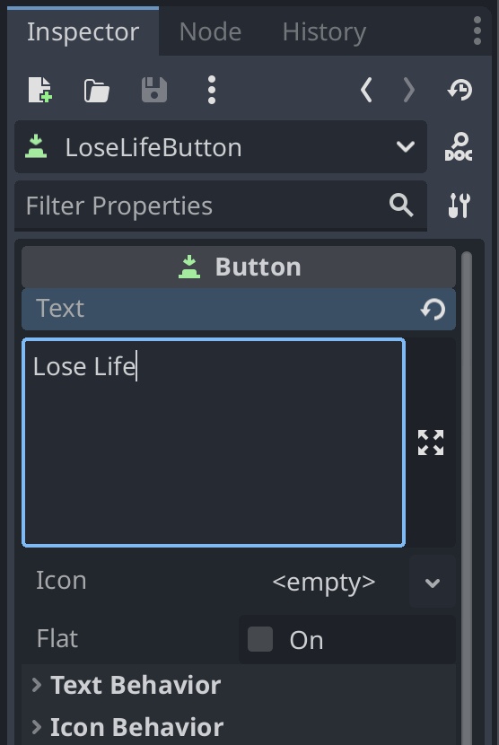
9. Move the button and resize (look for "font size" in the inspector)
   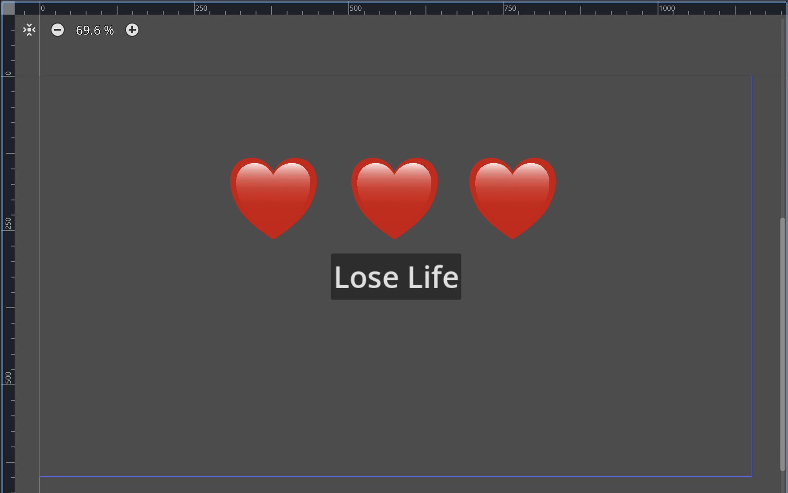

## Code

1. Now everything is set up for us to start coding to make it actually function!
2. Attach a script to the "LifeCounter" node
   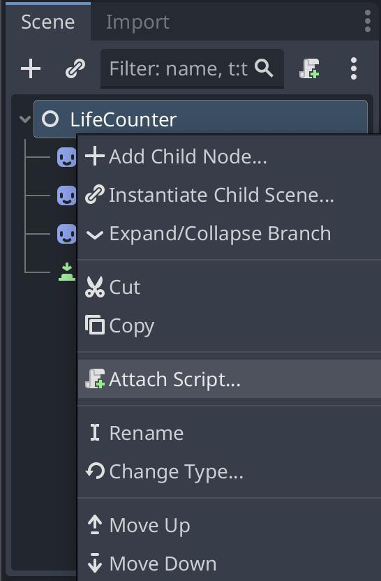
3. We want to write some code that will make one less heart display every time we click the Lose Life button. To run some code when we click the button, we can connect a signal from the button to our script. Select the LoseLifeButton node by clicking on it, then switch to the Node tab instead of Inspector.
   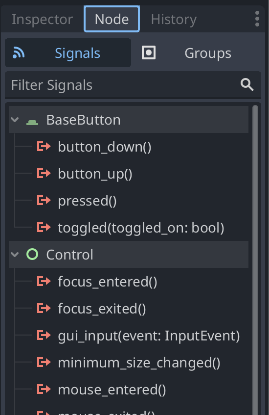
4. We want to run some code when the button is clicked, so which signal do you think we should use? I'm going to use the pressed() signal, but button\_down() and button\_up() also work here. Double click the signal to connect it.

```python
func _on_lose_life_button_pressed() -> void:
	pass # Replace with function body.

```

1. Now we have this function that will run every time we click the button. When that happens we want to decrease the number of lives we have. Let's write that in there to help us plan.

```python
func _on_lose_life_button_pressed() -> void:
	# decrease number of lives
	pass # Replace with function body.
```

1. This means we need a way to keep track of the number of lives we have. We can do that with a variable. Create a variable at the top of the code to keep track of our lives. We should start it equal to 3 since that's how many hearts we have and that's typical for most games.

```python
extends Node

var lives = 3
```

1. Now in our lose life function, we can decrease the number of lives from our lives variable. (We can also remove pass since we're filling in the function now)

```python
func _on_lose_life_button_pressed() -> void:
	# decrease number of lives by 1
	lives = lives - 1
```

1. Let's see if what we have so far is working. A good way to test if things are working is by using a print() in your code. In this case we're going to print out the current number of lives every time we click the button. So add a print statement to the lose life function

```python
func _on_lose_life_button_pressed() -> void:
	# decrease number of lives by 1
	lives = lives - 1
	print(lives)
```

1. If you haven't saved yet, do that now. Then play your game by clicking the play button and clicking "Select Current" if prompted. Then click your Lose Life button.
   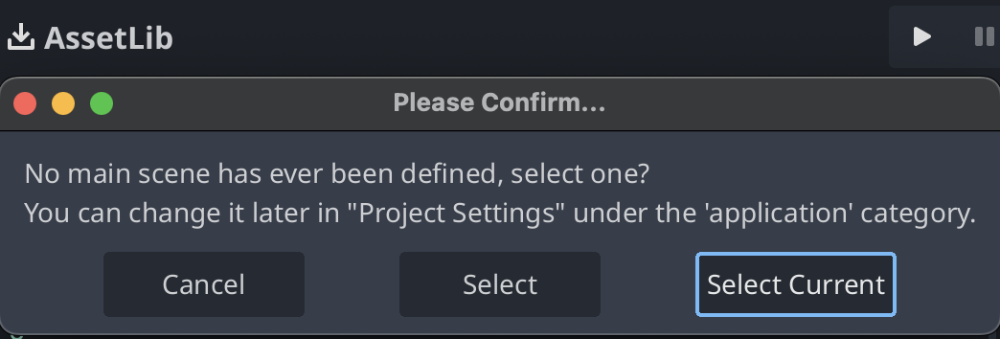
2. We don't see the hearts disappear because we haven't programmed them to do that yet, but if you look at the Output tab of Godot, you should see the number of lives go down every time you click the button!
   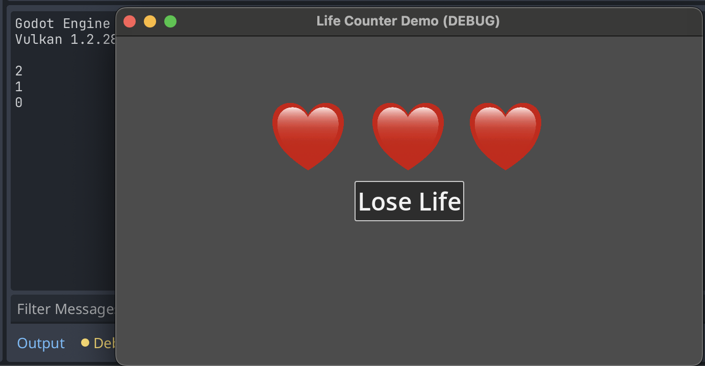
3. Great! We have the lives going down, now we have to make the hearts hide to match the number of lives. We can hide the hearts by making them invisible like this:

```javascript
$Heart1.visible = false
```

But we don't want to do that for all of them at the same time. We want to hide them one at a time. For example, we only want to hide the heart on the left if all 3 lives are lost. So we need to check the current number of lives and only hide the corresponding heart.

```python
func _on_lose_life_button_pressed() -> void:
	# decrease number of lives by 1
	lives = lives - 1
	print(lives)
	if (lives == 2):
		$Heart3.visible = false
	if (lives == 1):
		$Heart2.visible = false
	if (lives == 0):
		$Heart1.visible = false
```

Success!

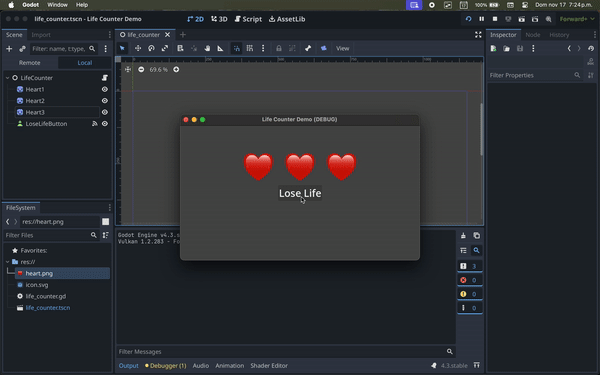

Now try to add another button called Heal that increases the lives and makes the hearts visible again.
